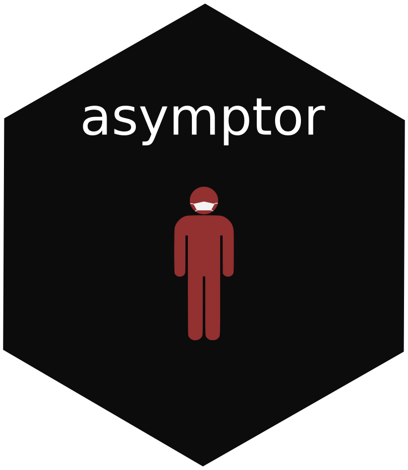

<!-- README.md is generated from README.Rmd. Please edit that file -->

```{r, include = FALSE}
knitr::opts_chunk$set(
  collapse = TRUE,
  comment = "#>",
  fig.path = "man/figures/README-",
  out.width = "100%"
)
```

# asymptor 

<!-- badges: start -->
[](https://github.com/asymptor/contactdata/actions)
[](https://www.tidyverse.org/lifecycle/#maturing)
[](https://codecov.io/gh/Bisaloo/asymptor?branch=main)
<!-- badges: end -->

The asymptor R package allows you to estimate the lower and upper bound of
asymptomatic cases in an epidemic using the capture/recapture methods from
Böhning et al.
([10.1016/j.ijid.2020.06.009](https://doi.org/10.1016/j.ijid.2020.06.009)) and
Rocchetti et al.
([10.1101/2020.07.14.20153445](https://doi.org/10.1101/2020.07.14.20153445)).

## Installation

You you can install the development version of asymptor from 
GitHub with:

```{r, eval = FALSE}
# install.packages("remotes")
remotes::install_github("Bisaloo/asymptor")
```

## Example

Please see the
[vignette](https://bisaloo.github.io/asymptor/articles/example.html) for a
detailed example using the COVID-19 data from New York.


